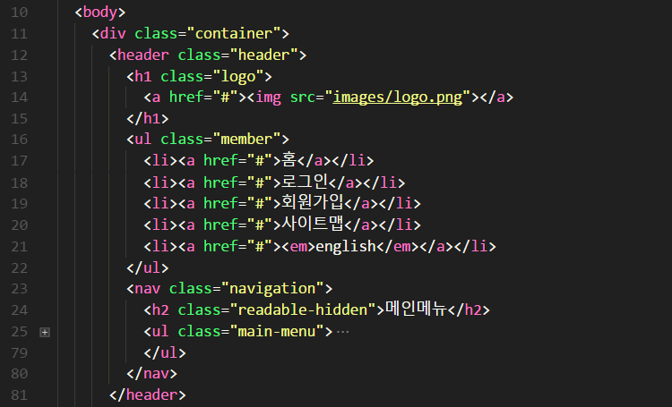
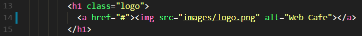
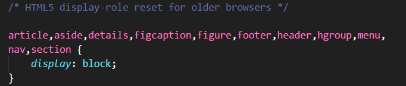
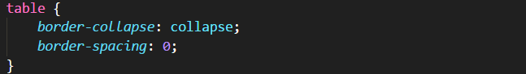

# FDS 7기 강의 내용 정리(2017년 11월 15일)

## 마크업의 첫 번째 순서는 '구조설계'이다
> .header 영역 안에 로고/텍스트링크/메뉴, __논리적(구성)순서__ 결정



#### 1. 로고


> 이미지가 읽히지 않을 때(예를 들어, 네트워크가 원활하지 않을 때) 대체되는 텍스트
의미있게 작성되어야 하며, 스크린리더기가 제대로 읽기 위해 적당한 띄어쓰기가 필요함

> 이미지에 대한 대체텍스트의 중요성 고려 
브라우저에서 headingsmap을 이용하여 자료구조를 확인 할 때 제목이 비어있어 파악하기 힘듦

#### 2. 대체텍스트 text link


ol(ordered list), 순서가 있는 리스트 / ul(unordered list), 순서와 상관없이 나열되는 리스트
> 컨텐츠의 종류에 따라 선택

(위의 텍스트 링크 마크업 참고)
로그인/회원가입을 해야만 사이트로서 사용이 용이할 때(서비스관점), 주메뉴보다 우선일 수 있다.
또한, 사용자의 관점 혹은 서비스 관점에서 우선순위는 바뀔 수 있다.

#### 3. 로그인
문서안에 문서를 품은 형태를 iframe
예) 다음/네이버 로그인, 로그인 버튼 전에 로그인유지 체크박스 마크업이 되어야 함

디자인에 종속된 마크업을 하면 안됨, 논리적 흐름에 따라 의미있는 마크업을!
이미지/텍스트로 처리 하는데 고민해볼 것 결정은 개발자의 몫..

#### 4. <a>태그
변경된 약관(<<여기에 링크연결)

#### 5. 숨김 헤딩 처리(스크린리더기가 해당컨텐츠를 인식하기 위한)

#### 6. 그룹핑(묶음)
div, span - 중립적 요소, 그룹핑한다.
div - 블록요소
span - 인라인요소
```
<span>HTML에 대해</span>
```
여기서, 텍스트를 선택하기 위해 span사용

#### 7. CSS file
.css 개발버전 - 주석 및 단락포함
.min.css 배포버전 - 최적화됨

#### 8. CSS workflow
개발버전 - uglify - 미니멀라이즈 - 배포 순서로 진행

#### 9. 벤더프리픽스 - 브라우저별 접두사
-webkit- 크롬, 사파리, 인터넷
특정 브라우저 사에서만 제어하기 위한 접두사

#### 10. normalize.css
normalize.css를 통해 agent style(각 브라우저가 기본적으로 가지고 있는 속성)을 재설정
각 브라우저별 동일하게 설정

#### 11. cascading(겹침)
마진병합현상

#### 12. reset.css / 에릭마이어
*(모두)선택해서 리셋하는 방법보다 필요한 태그만 추려 리셋설정 하는 것이 성능 면에서 좋음
필요하지 않은 요소설정을 피할 수 있기 때문에..

#### 13. font:inherit; 강제상속값

#### 14. 구형버전 브라우저에선 정의되지 않은 요소(html5속성)을 인라인속성으로 인식
> display:block;으로 재설정



#### 15. border-collapse: collapse;
테이블 th, td에 border를 보여줄 때 border-collapse: collapse를 사용하여 겹치는 선을 하나로 보이도록 설정

![Alt text]./(image/img_5.png)

#### 16. CSS선언순서의 중요성
최후의 CSS file 또는 line이 렌더링되며 가장 나중에 선언된 CSS로 덮어쓴다

#### 17. 웹폰트
@font-face 폰트의 자원과 성격을 선언
이와 같은 선언은, 폰트를 선 다운로드 후 적용되며, 폰트용량 커질수록 성능상 부담

# 폰트형태
serif 삐침이 있음 예, 바탕체
sans-serif 반듯한 고딕계열
다양한 폰트를 선언해서 만약 해당폰트가 존재하지 않을 때 차선책으로 적용할 대안 제시해야 함
CSS Validation Service는 @import 또는 @font-face(웹폰트) 체크는 불가

# 폴리필(호환성)
지원하지 않은 간극을 스크립트가 지원
완벽하진 않으나 호환시킬 수 있다. 단, 성능이 느려질 수 있음

Noto sans/ Spoka sans/ 본고딕 : 다 같은 폰트. 용량 큼.
참고링크 | https://www.slideshare.net/wsconf/web-font-wsconfseoul2017-vol2
김원준 - 웹폰트(Web Font) 파헤치기 [WSConf.Seoul.2017. Vol.2]
(위의 사이트 참고)
- 로컬경로 우선설정
- 오페라는 이제 웹킷계열 렌더링엔진으로 포함됨
- 성능에 최적화된 순서로 정해진 최종본 (슬라이드50p)
- woff2 최신지원브라우저 먼저 선언필요, 이후 woff선언

# margin collapsing(마진병합)
margin은 투명한 영역으로 병합이 발생(겹침이슈)
cf. padding은 병합되지 않음
# 상속이슈
a링크 color(agent기본속성)은 blue
내가 설정한 값이 기본속성의 값보다 우선순위가 높다

배치/레이아웃은 상속되지 않음
데코레이션 속성은 상속되는 경향이 많음

# 구체성 이슈 - 선언순서 중요*
a:link, a:visited(먼저 선언되어야 함)
a:hover, a:focus 

# position
fixed : viewport기준으로 배치됨
relative: 자기자신을 기준으로 배치, 본래 있었던 위치 기준으로 이동

# 모바일 링크 혹은 버튼 클릭 시 영역사이즈 관련,
성인남성 검지손가락 기준, 화면을 클릭하는 영역은 최소 44px 

# css는 인덱스를 1부터 시작한다
nth-child(2) : 2번째 요소
nth-child(n+6) : 6번째부터 나머지 전부요소 선택
